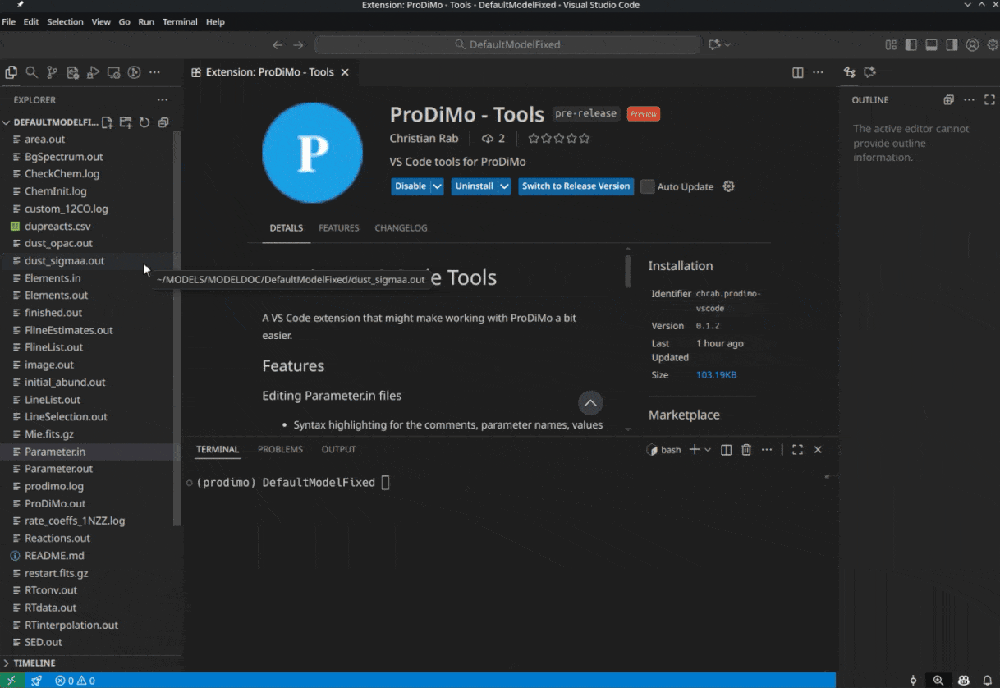

# ProDiMo - VS Code Tools

A VS Code extension that might make working with ProDiMo a bit easier.

## Features

<p align="center">
    
</p>

### Editing Parameter.in files

- Syntax highlighting for the comments, parameter names, values and units.
- Auto-completion for parameter names. Just press `!` or `Ctrl+Space` to see the suggestions
- Outline-View support. Just put some text between `---` and `---` to create a section in the outline view.

    Just do something like this:

    ```prodimoparam
    --- This will appear in the outline ---
    .true.     ! stop_after_init 


    --- Another block of parameters ---
    .false.    ! some Parameter 

    --- This will not appear in the outline, it is just an ordinary comment

    ```

### Outline-View for ProDiMo log files

If you open a log file produced by ProDiMo VS code will show the "structure" in the outline-view. The file has to have the extension `.log` and `prodimo` needs to be in the filename (e.g. `my_prodimo.log` or just `prodimo.log`); then VS code should automatically use the ProDiMo log file outline provider.

## Requirements

 No particular requirements, I know of.

## Extension Settings

No particular settings are needed for this extension.

## Known Issues

It is my very first VS Code extension, so there are probably issues.
The auto-completion is still a bit basic, and buggy.

## Release Notes

### 0.1.2

Initial beta release of the ProDiMo VS Code Tools extension.
